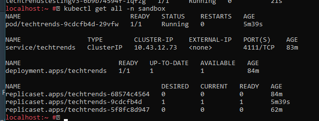

# Techtrends project using docker/github action/ argocd

## Techtrends Main Components

Techtrends involved consumer using news sharing platform that access the latest news within the __cloud native ecosystem__.

Techtrends project using :
* docker for application image creation
* Kubernetes for container orchestration

* Github action for continuous integration

* ArgoCD + Helm chart for continuous development

